# Set up Generative AI Hub in SAP AI Core
<!-- description --> Set up Generative AI Hub in SAP AI Core.
## Prerequisites
- A BTP global account
If you are an SAP Developer or SAP employee, please refer to the following links ( **for internal SAP stakeholders only** ) - 
[How to create a BTP Account (internal)](https://me.sap.com/notes/3493139)
[SAP AI Core](https://help.sap.com/docs/sap-ai-core?version=INTERNAL&locale=en-US&state=PRODUCTION)
If you are an external developer or a customer or a partner kindly refer to this [tutorial](https://developers.sap.com/tutorials/btp-cockpit-entitlements.html)
- A BTP global account, For more details, refer to: [BTP global account](https://statics.teams.cdn.office.net/evergreen-assets/safelinks/1/atp-safelinks.html)
- To continue this tutorial, you should have a BTP subaccount

## You will learn
- How to setup SAP AI Core to get started with Generative AI Hub.
- How to get  your Orchestration URL 

## Pre-read
In this tutorial, you’ll learn how to set up Generative AI Hub in SAP AI Core to start consuming Large Language Models (LLMs). By the end of the steps, you’ll have your Orchestration URL ready to use.

SAP AI Core and SAP AI Launchpad are services which you can link to your BTP global account. SAP AI Core offers a powerful AI runtime which is natively integrated with SAP AI Launchpad. The launchpad offers an easy-to-use interface to manage AI workflow administration, processes, and tasks.
 
The Generative AI Hub incorporates generative AI into your AI activities in SAP AI Core and SAP AI Launchpad. The generative AI hub is available only with the **extended** service plan in SAP AI Core.

If you are an existing SAP AI Core tenant with free tier or standard plan, you can upgrade to extended plan without losing your data or work.

Note: Upgrading from free tier to extended incur cost

Boosters is available for SAP AI Core. Boosters are a set of guided interactive steps that enable you to select, configure, and consume services on SAP BTP. In this tutorial, we'll use the SAP AI Core booster to to provision SAP AI Core in your subaccount with the extended plans.

> Remember, Generative AI Hub is available only for SAP AI Core **extended** plan.

> If you are an existing SAP AI Core tenant with **free** tier or **standard** plan, you can upgrade your instance to **extended** plan without losing your data or work. Upgrading from free Tier to extended incur cost.

> If you are an **SAP employee**, recommended to use **sap-internal** SAP AI Core plan instead of extended.

[Explore Generative AI Hub](https://help.sap.com/docs/sap-ai-core/sap-ai-core-service-guide/generative-ai-hub-in-sap-ai-core-7db524ee75e74bf8b50c167951fe34a5?locale=en-US&version=LATEST).

[SAP AI Core Service Plans](https://help.sap.com/docs/sap-ai-core/sap-ai-core-service-guide/service-plans?version=CLOUD)

---

### Add SAP AI Core Entitlements to your subaccount

Entitlements and quota are managed at the global account and directory levels, distributed to directories and subaccounts, and consumed by the subaccounts. See also [Entitlements and Quotas](https://help.sap.com/viewer/65de2977205c403bbc107264b8eccf4b/Cloud/en-US/00aa2c23479d42568b18882b1ca90d79.html).

- **Entitlements** are your right to provision and consume a resource. They refer to what you’re entitled to use (for example, which services and service plans).

- **Quota** is the numeric quantity that defines the maximum allowed consumption of that resource. In other words, how much of a service plan you’re entitled to use.

Open the SAP BTP cockpit, access your global account and go to your subaccount.


Check the entitlements for your subaccount by clicking `Entitlements` and searching for SAP AI Core.

Your current SAP AI Core entitlements will be shown. In this screenshot, you can find only standard plan is available

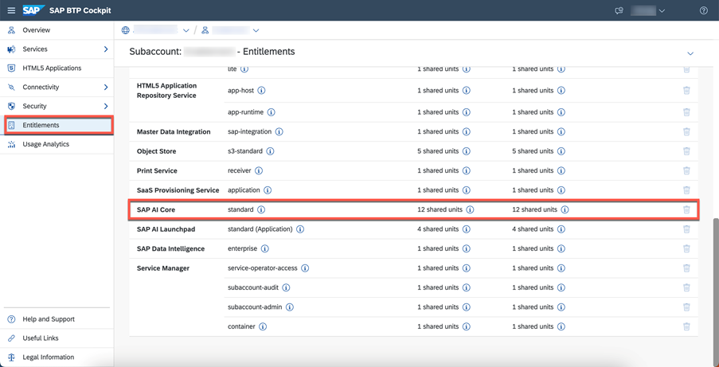

Click `Configure Entitlements` > `Add Service Plans`.


Select SAP AI Core and the `extended` service plan.


Save your new entitlement.

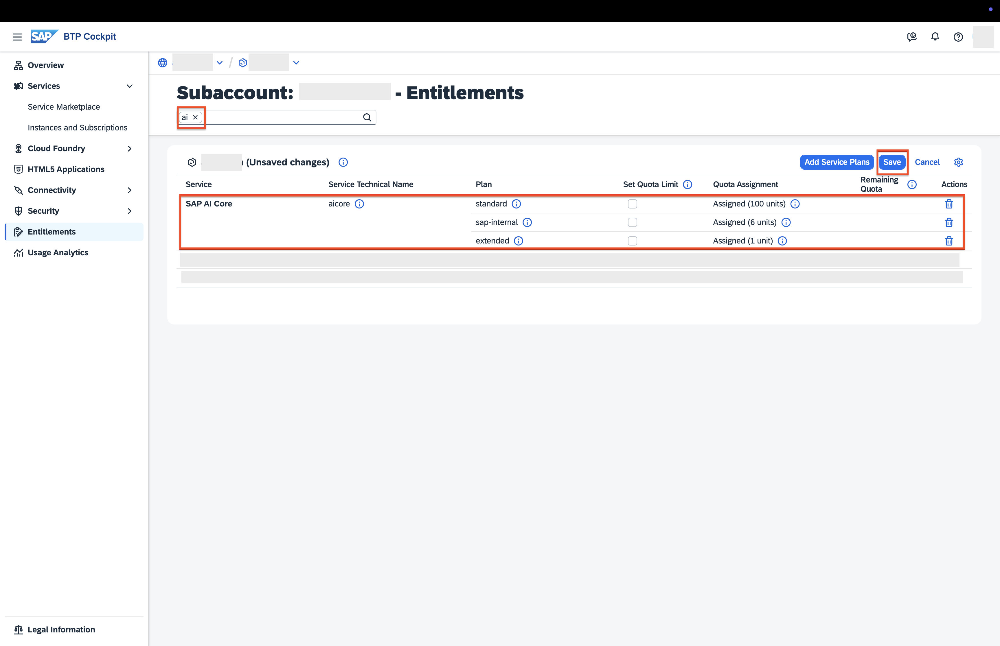

### Run the booster for SAP AI Core

Choose `Boosters` from the navigation pane. Find and choose the booster for `SAP AI Core` from the selection. 

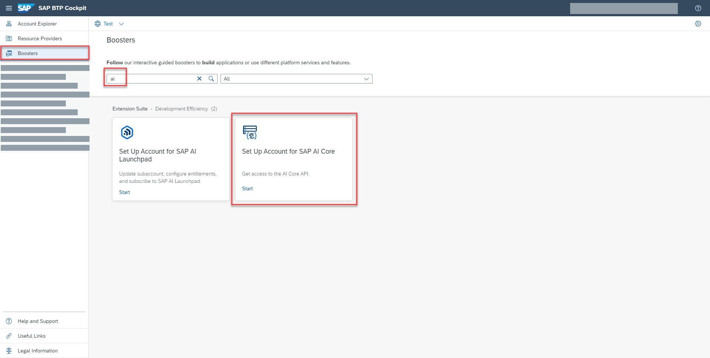

The booster tile contains information about SAP AI Core.  Click `Start` when you are ready. 

When you start a booster, a wizard opens up which guides you through the required steps.


Choose the scenario `Select Subaccount` and click `Next`


In the Configure Subaccount, select `extended` plan and your subaccount in which you want to provision SAP AI Core and click `Next`.

**Note:**

If you are SAP employee select the plan `sap-internal` instead of `extended`


Review your configuration and click `Finish`.

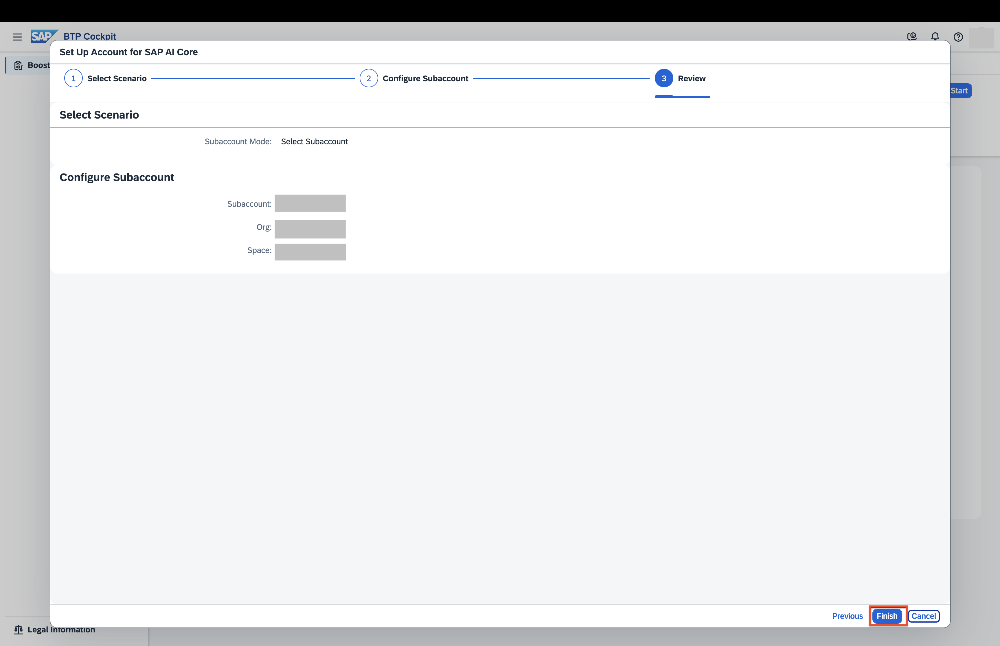

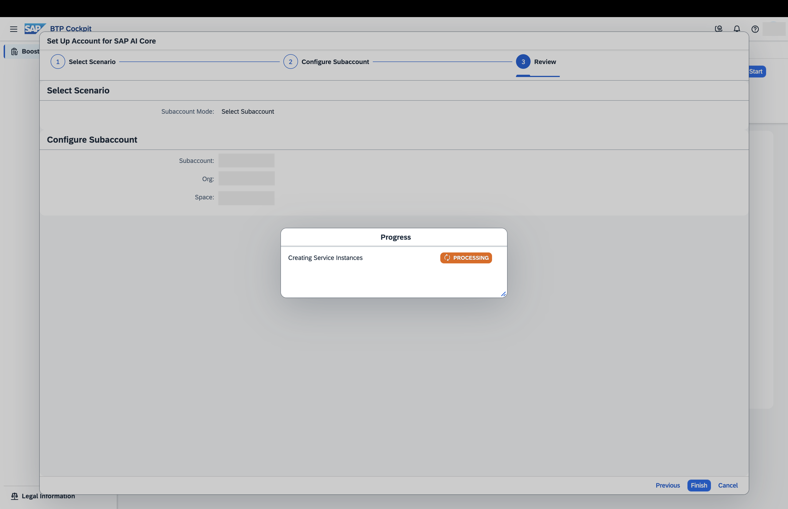

After the execution completes, follow the steps shown to navigate to your subaccount.

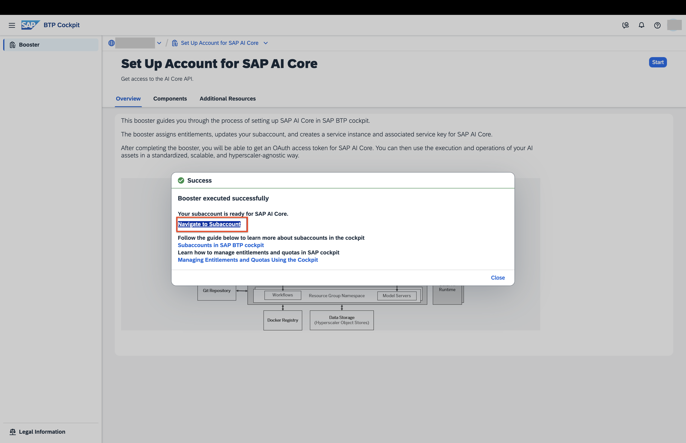


### View your instances and create your keys

In the subaccount section of SAP BTP Cockpit, choose `Services` from the left navigation menu and `Instances and subscriptions` from the page. 

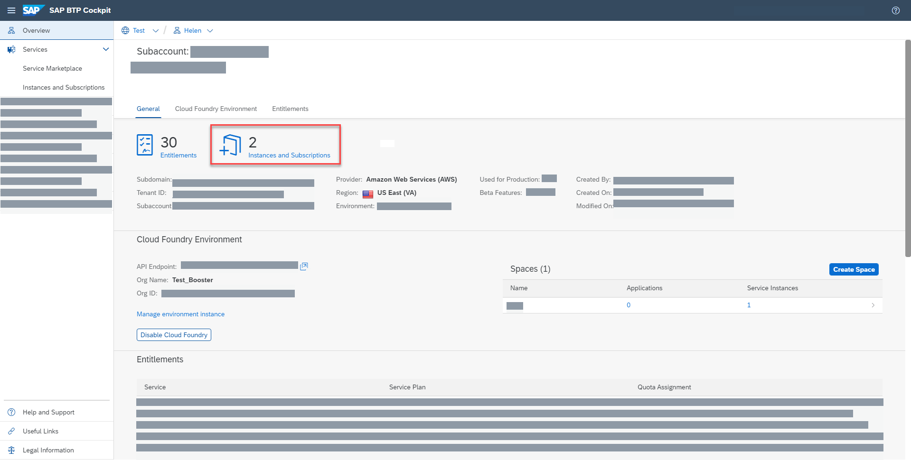

To see the details of your new SAP AI Core extended plan instance, click the chevron on the entry.

To create the keys that you need to access your instance, click the three dots > `Create Service Key`.


Enter a `Key Name` of your choice and click `Create`.

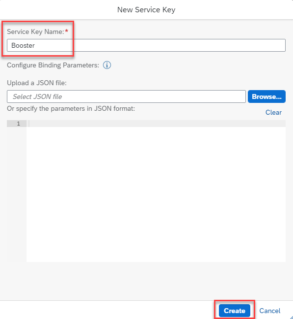
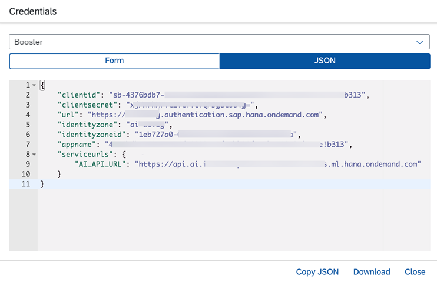

Once your keys have been created, you can view or download them at any time by locating the key and clicking the three dots and choosing from the available options.

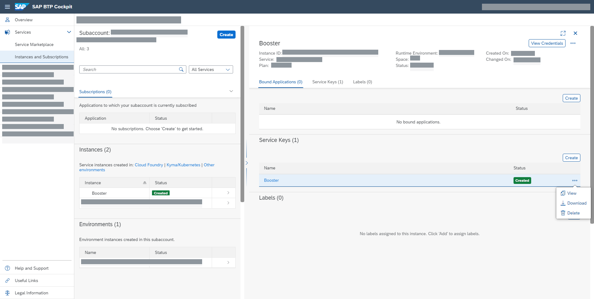

### Get Started with Orchestration

As part of the SAP AI Core onboarding process, an `orchestration deployment` is automatically created in the `default resource group`.

This means you can start using orchestration in the Generative AI Hub right away—no need to create a separate deployment.

#### Retrieve Orchestration URL

Get Auth Token:

> **Note:**  Refer to the fields such as `url`, `clientid`, `clientsecret`, and `AI_API_URL` in your SAP AI Core service key, and replace the corresponding placeholder values in the curl requests below.

```
curl --request POST \
  --url <replace with the url field from your SAP AI Core service key>/oauth/token \
  --header 'Content-Type: application/x-www-form-urlencoded' \
  --data grant_type=client_credentials \
  --data 'client_id=<replace with the clientid from your service key>' \
  --data 'client_secret=<replace with the clientsecret from your service key>'
```

From the response, note the value of the `access_token`. You’ll use this token in the next step to `retrieve your deployments` using the following example curl request:

```
curl --request GET \
  --url <replace with the AI_API_URL from your SAP AI Core service key>/v2/lm/deployments \
  --header 'AI-Resource-Group: default' \
  --header 'Authorization: Bearer <replace with the access_token from get token response>'
```

In the response, search for the deployment where the `configurationName is defaultOrchestrationConfig`, and note the `deploymentUrl` associated with this deployment. The `deploymentUrl` is your `orchestration Url`.

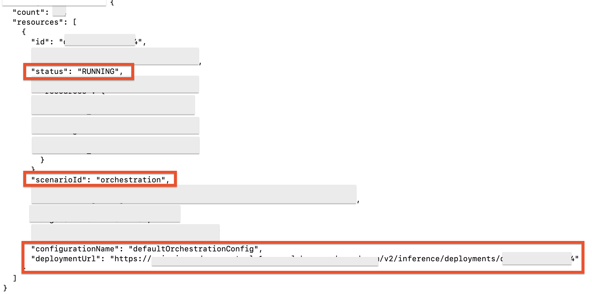


Once you have the `Orchestration Url` you can proceed to the [Orchestration Tutorial](https://developers.sap.com/tutorials/ai-core-orchestration-consumption.html) to learn `how to consume generative AI models using the orchestration capabilities available in the Generative AI Hub`.
