# Use the SAP Content Agent Service UI to Start the Transport
<!-- description --> As an alternative to managing transports directly in the SAP Integration Suite UI, you can also use the SAP Content Agent UI to start a transport. In this case, some extra configuration steps are needed, and some steps from the previous tutorials may no longer apply.  

## Prerequisites
 - You've completed the tutorials:
 - [Transport SAP Integration Suite Content using SAP Cloud Transport Management service and SAP Content Agent service](btp-transport-management-cpi-01-use-case)
 - [Set Up the SAP Integration Suite Source Subaccount](btp-transport-management-cpi-02-set-up-source-account) with the following exceptions: You can omit **Step 3: Create a Service Instance for SAP Content Agent**, **Step 4: Create a Service Key for the SAP Content Agent Instance**, and **Step 5: Create an SAP Content Agent Destination in the SAP BTP Source Account**. Instead, you subscribe to SAP Content Agent. The subscription process is part of the current tutorial.
 - [Set Up the SAP Integration Suite Target Subaccount](btp-transport-management-cpi-03-set-up-target-account)
 - [Create a Transport Destination and Configure the SAP Integration Suite Transport Landscape](btp-transport-management-cpi-04-connect-source-and-target)
 - [Establish an Export Connection from SAP Content Agent Service in the Source Subaccount to SAP Cloud Transport Management Service](btp-transport-management-cpi-05-create-ctms-destination)

## You will learn
   - All configuration steps required to transport SAP Integration suite content from a source subaccount to a target subaccount using the SAP Content Agent UI on the source subaccount to start the transport. 
   

## Scenario Overview

This tutorial outlines the steps to start the transport of SAP Integration Suite content using the SAP Content Agent UI. Instead of creating an SAP Content Agent instance, service key, and a destination to SAP Content Agent on the source subaccount, you need a subscription to SAP Content Agent and the appropriate role collection assigned to start the UI. You don't need to enable the transport in SAP Integration Suite. 

>Since you manage the content transport using the SAP Content Agent UI, SAP Integration Suite doesn't need to notify SAP Content Agent about new transport candidates. Content suitable for transport is directly accessed through the *CloudIntegration* destination that was previously set up. As a result, the *ContentAssemblyService* destination isn't needed.

>If you've already configured the entities in the previous tutorials, you can leave them as they are. They won't interfere with the setup for using the UI. 

   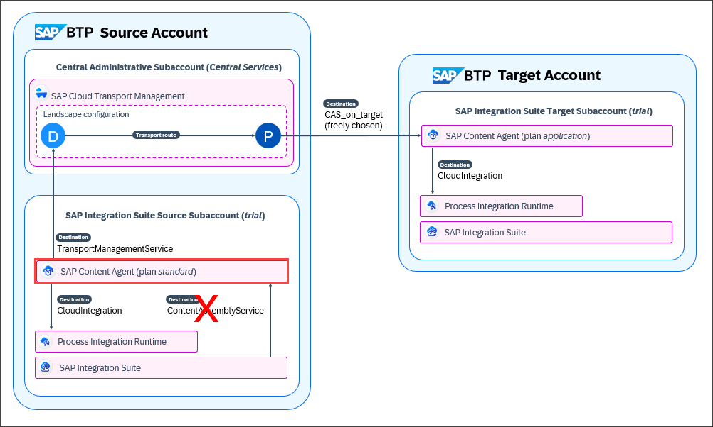

Additional resources about using the SAP Content Agent UI:
- [Supported Transport Scenarios](https://help.sap.com/docs/CONTENT_AGENT_SERVICE/ae1a4f2d150d468d9ff56e13f9898e07/66284c976cf049afb708dfee3e0aaac4.html) in the SAP Content Agent documentation on SAP Help Portal 
- Blog post [Transport selected artefact to Cloud Transport Management service using Content Agent UI](https://community.sap.com/t5/technology-blogs-by-sap/transport-selected-artefact-to-cloud-transport-management-service-using/ba-p/13921590)

---
### Open the SAP BTP Cockpit

>This step assumes that you're running the tutorial in the SAP BTP Trial account. If you have an enterprise account, open SAP BTP Cockpit in your enterprise account. In this tutorial, you need access to both the SAP BTP source and target accounts.  

1. To access SAP BTP Cockpit of the source SAP BTP trial account, go to your [SAP BTP Trial landing page](https://account.hanatrial.ondemand.com/trial/#/home/trial) and choose **Go To Your Trial Account**. (The name of the button may vary.)
   
    - You will use the **trial** subaccount to open SAP Content Agent UI and start the transport.

    - You will use the **Central Services** subaccount to go to the SAP Transport Management service UI and start the import of the integration content.  

2. To access SAP BTP Cockpit of the target SAP BTP trial account, ask your colleague to log on to their SAP BTP account.  
   
    You or your colleague will use the **trial** subaccount to go to the SAP Integration Suite UI. You'll verify **before** the transport that the integration content doesn't exist in the **Design** section. **After** the transport, you'll verify that it was imported there.

### Subscribe to SAP Content Agent

1. In the SAP Integration Suite source subaccount **trial**, choose **Services > Service Marketplace** from the navigation on the left (1). In the search field, filter for *Content Agent Service* (2). On the **Content Agent Service** tile, select the three dots **...**, and choose **Create** (3).

    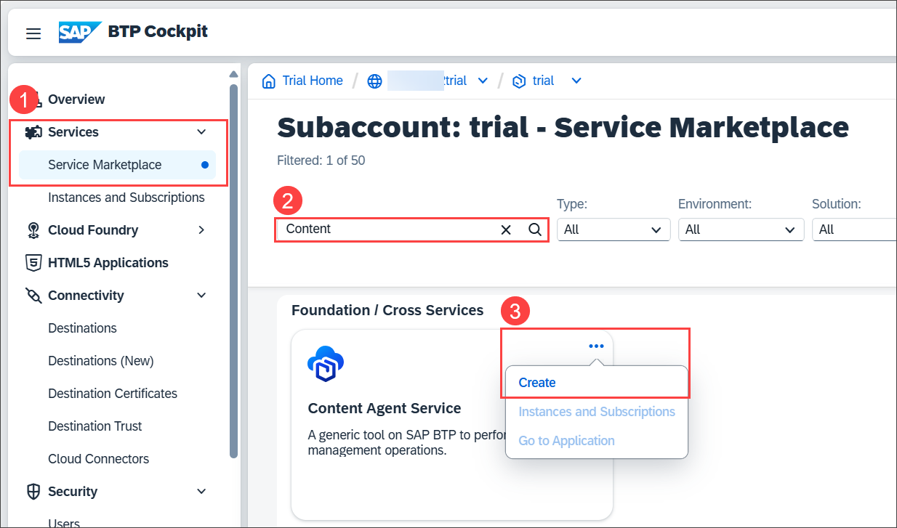

2. Select the *free* subscription plan from the **Plan** dropdown menu of Content Agent Service (1), and choose **Create** (2). 

    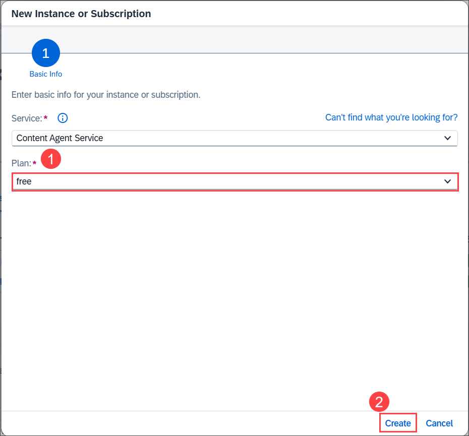 

3. When the subscription has completed, it gets the green **Subscribed** status. 

    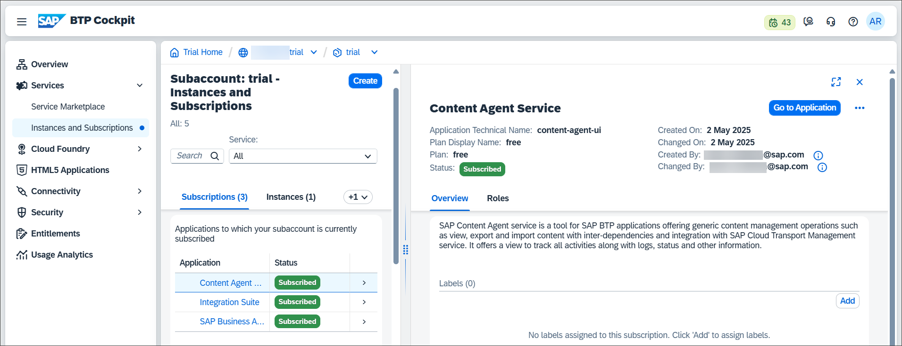 

See also on SAP Help Portal: [Subscribe to Content Agent User Interface](https://help.sap.com/docs/CONTENT_AGENT_SERVICE/ae1a4f2d150d468d9ff56e13f9898e07/fe2599a57535408ebf1596854fbe6043.html)

### Assign Role Collection for SAP Content Agent

To use the UI of SAP Content Agent, assign a role collection.

1. In the SAP Integration Suite source subaccount **trial**, choose **Security > Users** from the navigation on the left (1). Select your user (2).

     

2. In the details of your user, select the **Role Collections** tab (1), and choose **Assign Role Collection** (2).

     

3. In the **Assign Role Collection** dialog, filter for **Content Agent** (1). Select the **Content Agent Admin** role (2), and choose **Assign Role Collection** (3).

     

4. The **Content Agent Admin** role was added to your user.

    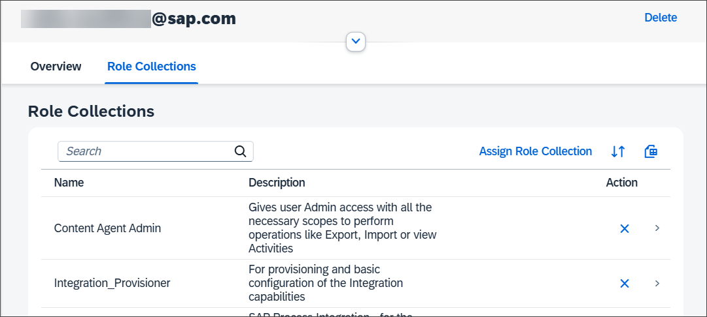 

You’ve completed all configuration steps required to transport integration content from your source subaccount to your target subaccount using the SAP Content Agent UI.

See also on SAP Help Portal: [Assign User Roles and Permissions](https://help.sap.com/docs/CONTENT_AGENT_SERVICE/ae1a4f2d150d468d9ff56e13f9898e07/b3e350efd6ce4fe7b10da526676041a2.html)

You can now run a test transport to learn how to start the transport in the SAP Content Agent UI. As a next step, select some standard SAP Integration Suite content that you want to transport. 

### Select SAP Integration Suite Content To Be Transported in SAP Integration Suite UI

>If you already have integration content to transport, you can skip this step.

You can use any standard content from the **Discover** section in SAP Integration Suite, and copy it to the **Design** section. This content will be available for transport in SAP Content Agent. 

1. In the **trial** source subaccount, choose **Services > Instances and Subscriptions** from the navigation on the left (1). Open the UI of SAP Integration Suite by clicking on the link or the icon (2).

    

    The UI of SAP Integration Suite opens in a new tab or window.

2. In the SAP Integration Suite UI, choose **Discover > Integrations** (1). In the **Discover** section, select any content, here *SAP S/4HANA Integration with SAP Digital Manufacturing* (2).  

    >If you don't see the **Discover** section, assign the `PI_Integration_Developer` role to your user (see also step 2 of tutorial [Set Up the SAP Integration Suite Source Subaccount](btp-transport-management-cpi-02-set-up-source-account)).

    

3. In the detail view of the integration package, choose **Copy**.

    

4. Choose **Design > Integrations and APIs** (1). The *SAP S/4HANA Integration with SAP Digital Manufacturing* is now available in the **Design** section. 

    

### Start the Transport in SAP Content Agent UI

1. In the **trial** source subaccount, choose **Services > Instances and Subscriptions** from the navigation on the left (1). Open the UI of SAP Content Agent by clicking on the link or the icon (2).

    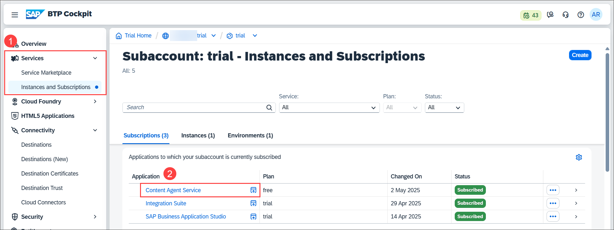

    The UI of SAP Content Agent opens in a new tab or window. The **Activities Performed** tile is empty as expected from a new instance. The **Cloud Transport Management** tile shows the **Connected** status. This status indicates that the destination to SAP Cloud Transport Management is configured correctly in the subaccount.

2. In the SAP Content Agent UI, choose **Export** to start the **Export Content Wizard**.

    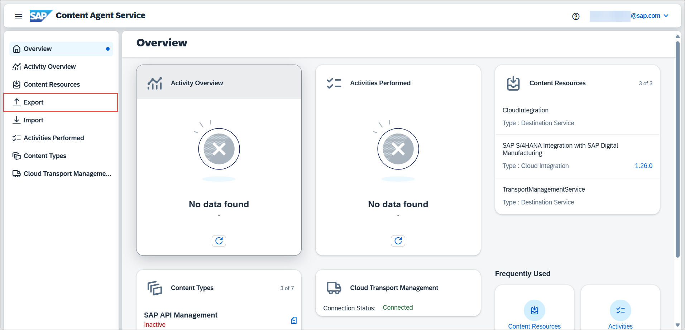

3. The *SAP S/4HANA Integration with SAP Digital Manufacturing* content package is in the list of content that can be exported. When content includes subcomponents, you can expand it to view them. Click on the arrow to do this. 

    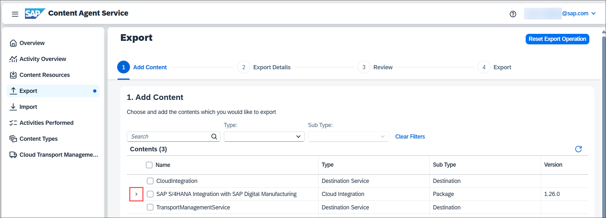

4. When you select the content, the system automatically preselects any mandatory subcomponents. Here, no mandatory subcomponents are selected. 

    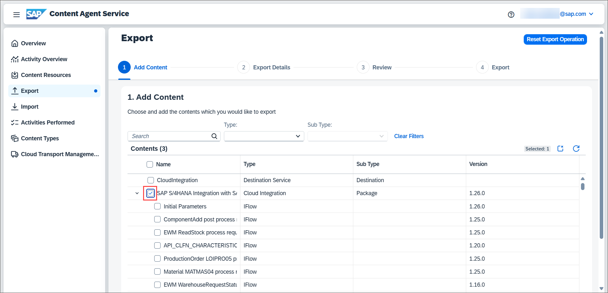
 
5. SAP Content Agent allows you to more effectively manage content transport by customizing and combining different subcomponents across single or multiple cloud integration packages and artifacts. For testing purposes, select some subcomponents that you want to export (1), and choose **Step 2** (2). 

    

6. In the **Export Details** step, the *Export Mode*: **SAP Cloud Transport Management** is preselected. Select the *Source Node*, here **DEV_NODE** (1). Enter a description, here `SAP S/4HANA Integration with SAP Digital Manufacturing started in Content Agent UI` (2). Choose **Step 3** (3). 

    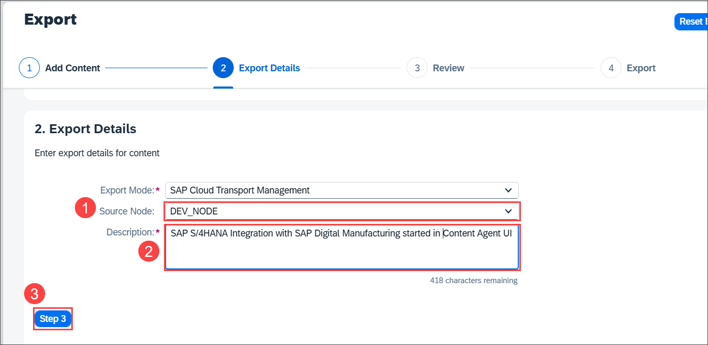

7. In the **Review** step, the content that you've selected for transport is displayed along with the **Export Mode** details. Choose **Step 4**.

    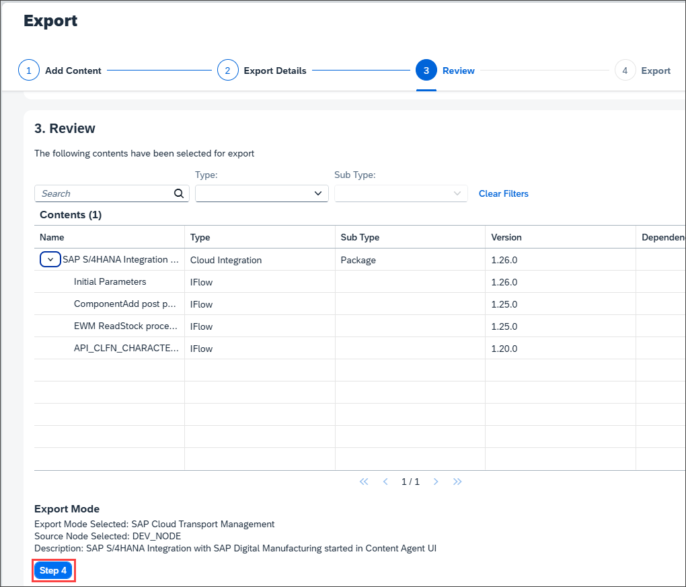

8.  The content is exported. SAP Content Agent displays the export progress. Once it's completed, you see a success message. To go to the activity page, click the activity ID link.

    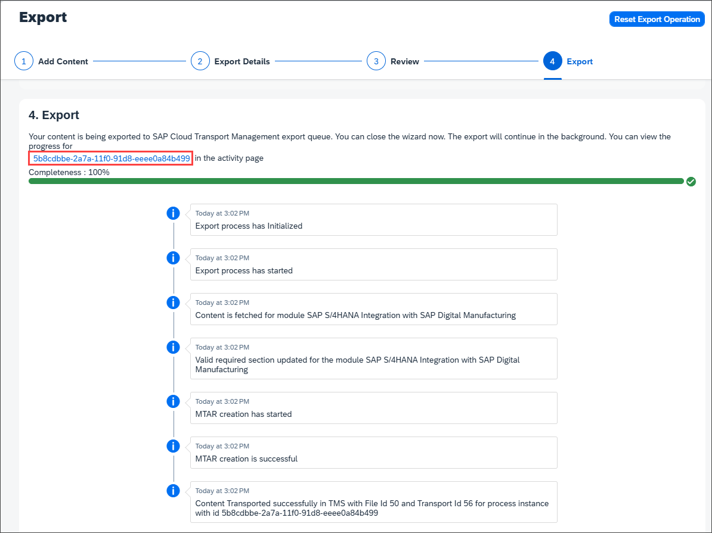

9.  On the **Activities Performed** screen, the recent export activity is displayed. Click anywhere in the row to display more details.   

    

10. Detailed activity logs are displayed. Choose **Transport Details**.

    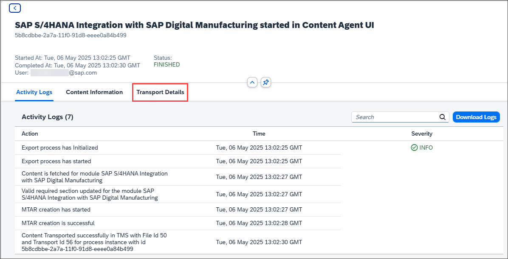

11. On this tab, the target node as configured in SAP Cloud Transport Management service is displayed. Choose the **View Transport Request 56** link to open this request in the SAP Cloud Transport Management UI. 

    

12. The SAP Cloud Transport Management UI opens in a new browser tab or window. The `TARGET_NODE` is displayed. 

    

Before importing content into the target subaccount, you can optionally verify that it doesn't already exist there. 

See also on SAP Help Portal: [Export Content Wizard](https://help.sap.com/docs/CONTENT_AGENT_SERVICE/ae1a4f2d150d468d9ff56e13f9898e07/b23677cfafeb47afad66530ff6a8c35d.html)

### (Optional) Verify That Integration Content is Not Available in Target

To verify that the content package is not yet available in the **Design** section of SAP Integration Suite in the target subaccount, proceed as follows.

1. You or your colleague: Log on to the **target** SAP BTP account. Select the **trial** subaccount.

2. Choose **Services > Instances and Subscriptions**, and select the **Integration Suite** link or the corresponding icon to open the UI.

3. The SAP Integration Suite UI opens in a new browser tab or window. Choose **Design > Integrations and API**. The **Design** section in the SAP Integration Suite target is empty.  

    

### Import the Integration Content

Return to the SAP Cloud Transport Management UI in the SAP BTP source account in the central administrative subaccount **Central Services** that you've opened from the SAP Content Agent UI.  

1.  To go to the import queue, click on the TARGET_NODE.

    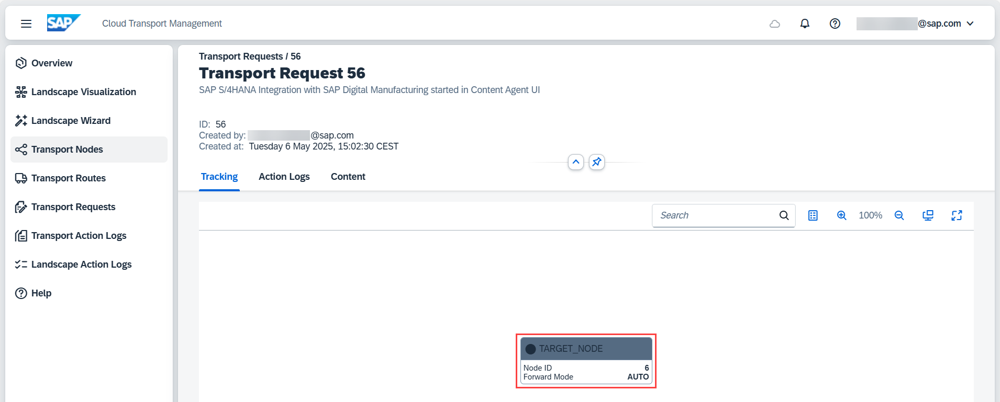

    The import queue of the **TARGET_NODE** opens. The transport request created for the integration content was added to the import queue with an **Initial** status. The description that you've entered in step 2 of the **Export Content Wizard** in the SAP Content Agent UI is displayed as the **Transport Description**. Your user email address is displayed as the **Owner** of the transport request. 

2. To start the import, choose **Import All**. 

    

3. Approve the import.

    

4. When the import is successful, the status of the transport request changes to **Succeeded**. You can display more details about the import in the log of the transport request. To display the log, click on the log icon.

    

5. The log contains detailed information about the individual import steps. When you scroll down to the end, the log shows that the import has ended with the status **Success**.

    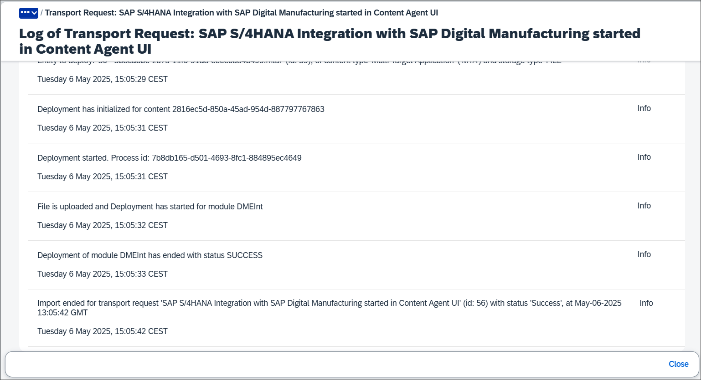

### Verify The Successful Import

1. Return to the SAP Integration Suite UI on the **target** account to verify that the integration content has arrived there. Since you had previously opened the UI, refresh the browser to reload the UI.

2. In the **Design** section in the target subaccount, you can now see the *SAP S/4HANA Integration with SAP Digital Manufacturing* integration package. The credentials of the client ID from the SAP Content Agent service key on the target subaccount are displayed as the user who created the integration flow. This way, you can confirm that the integration flow was imported in the target subaccount.

    

Congratulations! You've successfully set up the scenario to start the transport using SAP Content Agent UI. In particular, use it to transport content of multiple applications or services together, and start the transport for multiple content types at once.

