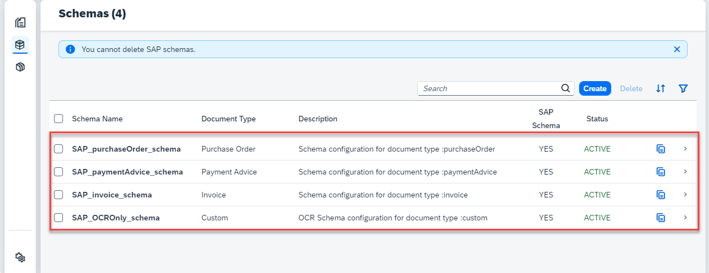
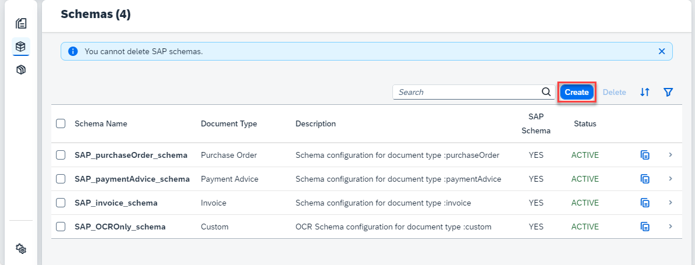
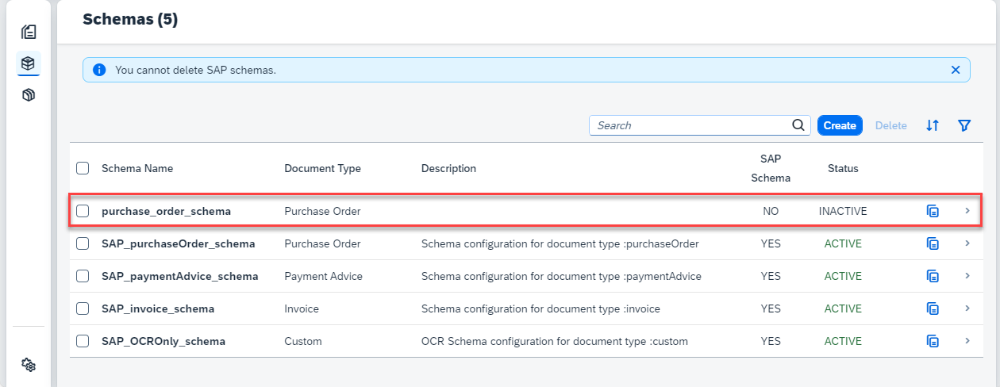
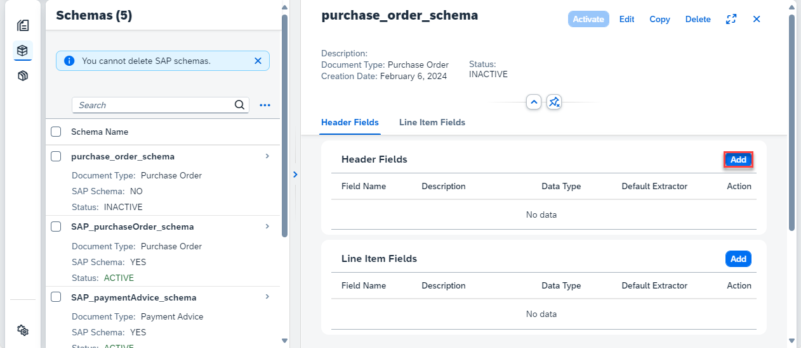
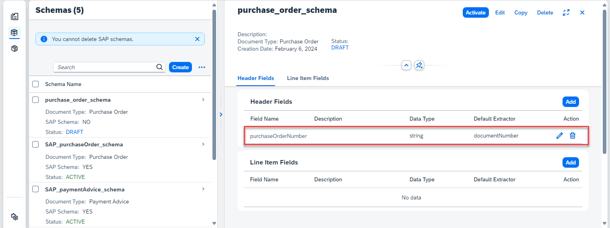
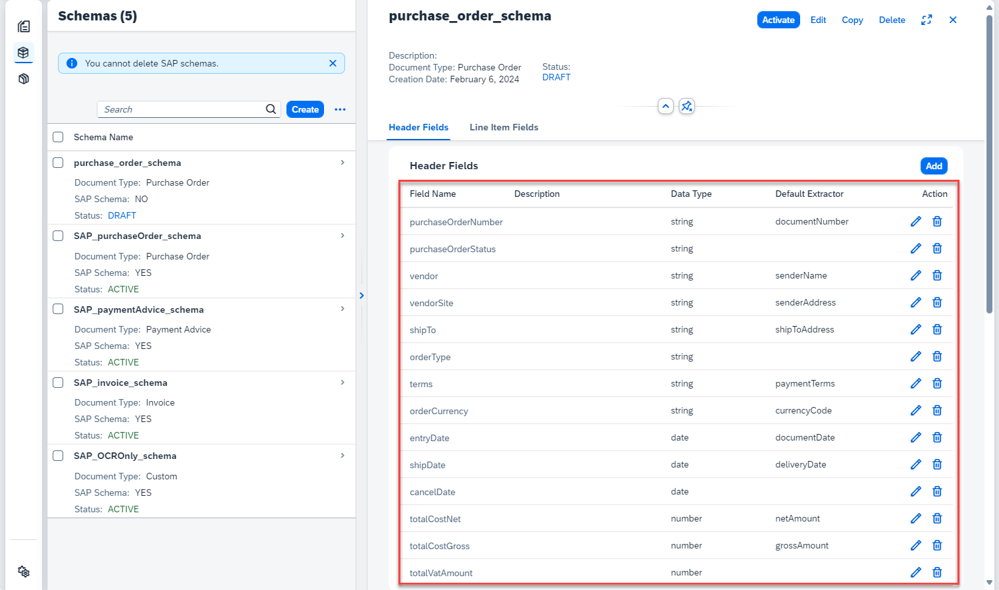
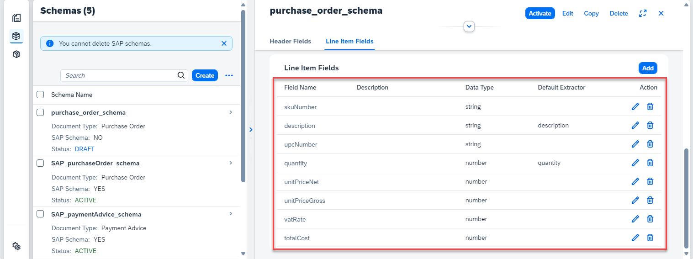
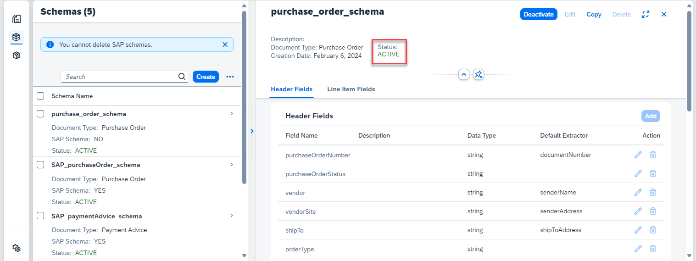

# Create Schema for Purchase Order Documents
<!-- description --> Create a schema for your purchase order documents to extract information from similar documents using SAP Document AI.

## You will learn
  - How to create a schema for purchase order documents
  - How to add standard and custom data fields for the header and line item information of purchase order documents

## Intro
The core functionality of SAP Document AI is to automatically extract structured information from documents using machine learning. The solution supports extraction from the following standard document types out of the box: invoices, payment advices, and purchase orders. You can customize the information extracted from these document types by creating a schema and adding the specific information that you have in your documents. Additionally, you can add completely new document types.

If you are new to the SAP Document AI basic UI, first try out the tutorial: [Use Machine Learning to Extract Information from Documents with SAP Document AI Basic UI](cp-aibus-dox-ui).

---

### Access schema configuration

1. Open the SAP Document AI basic UI, as described in the tutorial: [Use Trial to Set Up Account for SAP Document AI and Go to Application](cp-aibus-dox-booster-app) or [Use Free Tier to Set Up Account for SAP Document AI and Go to Application](cp-aibus-dox-free-booster-app).

    >If you **HAVE NOT** just used the **Set up account for SAP Document AI** booster to create a service instance for SAP Document AI and subscribe to the SAP Document AI basic UI, observe the following:

    >- To access the [Schema Configuration](https://help.sap.com/viewer/5fa7265b9ff64d73bac7cec61ee55ae6/SHIP/en-US/3c7862e30fc2488ea95f58f1d77e424e.html) and [Template](https://help.sap.com/viewer/5fa7265b9ff64d73bac7cec61ee55ae6/SHIP/en-US/1eeb08998f49409681c06a01febc3172.html) features, ensure that you use the `blocks_of_100` plan to create the service instance for SAP Document AI Trial.

    ><!-- border -->

    >- And make sure you're assigned to the role collection: `Document_Information_Extraction_UI_Templates_Admin_trial` (or `Document_Information_Extraction_UI_Templates_Admin` if you're using the free tier option). For more details about how to assign role collections, see step 2 in the tutorial: [Use Trial to Subscribe to the SAP Document AI Basic UI](cp-aibus-dox-ui-sub), or step 3 in the tutorial: [Use Free Tier to Subscribe to SAP Document AI Basic UI](cp-aibus-dox-free-ui-sub).

    ><!-- border -->

    >- After assigning new role collections, **Log Off** from the UI application to see all features you're now entitled to try out.

    ><!-- border -->

2. In the left navigation pane, click **Schema Configuration**.

    <!-- border -->

Here, you find the SAP schemas. The SAP Document AI basic UI provides preconfigured SAP schemas for the following standard document types:

* Purchase order
* Payment advice
* Invoice 

In addition, there’s an SAP schema for custom documents (`SAP_OCROnly_schema`). You can use SAP schemas unchanged to upload documents.

>**NOTE:** You can’t edit or delete original SAP schemas. Always create a copy and then edit the default fields, as required.

<!-- border -->

>**CAUTION:**

>When using the free tier option for SAP Document AI or a trial account, be aware of the technical limits listed in [Free Tier Option and Trial Account Technical Constraints](https://help.sap.com/docs/document-information-extraction/document-information-extraction/free-tier-option-and-trial-account-technical-constraints).

### Create schema

To create your own schema, click **Create**.

<!-- border -->

In the dialog that appears, enter a name for your schema, `purchase_order_schema`, for example. Note that the name cannot include blanks. Further, select `Purchase Order` as your **Document Type**.

Click **Create** to create the schema.

<!-- border -->

Now, your schema shows up in the list. Access the schema by clicking on the row.

<!-- border -->

### Understand schemas

A schema contains a list of header fields and line item fields representing the target information that you want to extract from a particular type of document. You must select a schema when you add documents to the SAP Document AI basic UI.

You can either create your own schema from scratch or use a preconfigured SAP schema. If you don’t want to configure your own schema, you can select the appropriate SAP schema unedited when you add a document on the SAP Document AI basic UI. No configuration is needed when you use SAP schemas in this way. Alternatively, you can copy a suitable SAP schema and edit the default fields in line with your needs.

SAP Document AI already includes a number of fields that it can extract. See [here](https://help.sap.com/viewer/5fa7265b9ff64d73bac7cec61ee55ae6/SHIP/en-US/b1c07d0c51b64580881d11b4acb6a6e6.html) which header fields are supported and [here](https://help.sap.com/viewer/5fa7265b9ff64d73bac7cec61ee55ae6/SHIP/en-US/ff3f5efe11c14744b2ce60b95d210486.html) which line item fields are supported. Additionally, you can define custom fields. In the next step, you'll learn about both.

The image below shows an example of a purchase order. All the fields that you define in your schema in this tutorial are highlighted. The header fields represent all information outside the table that occurs once. The line item fields represent all information within the table that occurs for each product. You can, of course, extend or reduce the information that you want to extract.

<!-- border -->

### Add header fields

To define your first header field, click **Add** to the right of the heading `Header Fields`.

<!-- border -->

For each field, you have to enter a name, a data type, a setup type, and optionally a default extractor and a description. The available data types are `string`, `number`, `date`, `discount`, `currency`, and `country/region`. 

The available setup types are `auto` and `manual`. The setup type `auto` supports extraction using the solution’s machine learning models. You must specify a default extractor (standard fields supported by SAP Document AI) for this setup type. It can only be used in schemas created for standard document types. The setup type `manual` supports extraction using a template. It’s available in schemas created for standard or custom document types.

If you'd like to find out more about setup types and how they relate to document types, extraction methods, and default extractors, see [Setup Types](https://help.sap.com/docs/document-information-extraction/document-information-extraction/setup-types).

As your first header field, add the purchase order number, which identifies your document.

1. Enter an appropriate name for your field, `purchaseOrderNumber`, for example.

2. Select `string` for the `Data Type`. Note that a document number is a `string`, even though it consists of numbers, as it is an arbitrary combination of numbers without meaning. In contrast, price is an example of the data type `number`.

3. As all business documents have a unique identification, SAP Document AI already includes a standard field. Select `auto` for the `Setup Type` and then select `documentNumber` for the `Default Extractor`.

4. Click **Save** to add the header field.

    <!-- border -->

The field now displays in your list of header fields, where you again find all the information that you've just entered. You can edit or delete the field by clicking the respective icons on the right.

<!-- border -->

You've now added your first header field that uses a default extractor from SAP Document AI. Next, you'll add your first custom header field,

Click **Add** again to open the dialog.

1. Enter an appropriate name for your field, `purchaseOrderStatus`, for example.

2. Select `string` for the `Data Type`.

3. As SAP Document AI offers no equivalent field, select `manual` for the `Setup Type`. Click **Save** to add the field.

    <!-- border -->

You've now added your first custom field. Go ahead and add the header fields shown in the table and image below. Pay attention to which fields have a default extractor and which don't. Feel free to extend or reduce the list of header fields.

|  Field Name           | Data Type   | Setup Type  | Default Extractor
|  :------------------- | :---------- | :---------- | :-----------------
|  `purchaseOrderNumber`| string      | auto        | `documentNumber`
|  `purchaseOrderStatus`| string      | manual      | none
|  `vendor`             | string      | auto        | `senderName`           
|  `vendorSite`         | string      | auto        | `senderAddress`
|  `shipTo`             | string      | auto        | `shipToAddress`
|  `orderType`          | string      | manual      | none
|  `terms`              | string      | auto        | `paymentTerms`              
|  `orderCurrency`      | string      | auto        | `currencyCode`
|  `entryDate`          | date        | auto        | `documentDate`
|  `shipDate`           | date        | auto        | `deliveryDate`
|  `cancelDate`         | date        | manual      | none
|  `totalCostNet`       | number      | auto        | `netAmount`              
|  `totalCostGross`     | number      | auto        | `grossAmount`
|  `totalVatAmount`     | number      | manual      | none

<!-- border -->

>**NOTE:** The SAP Document AI basic UI also includes a feature that allows you to group schema fields by category. To use this feature, you must first activate it under **UI Settings**. For simplicity's sake, we haven't included the feature in this tutorial. If you'd like to find out more about it, see [Schema Field Categories](https://help.sap.com/docs/document-information-extraction/document-information-extraction/schema-field-category). 

### Add line item fields

Next, you need to define the line item fields. As your first line item field, add the SKU (stock keeping unit) that uniquely identifies an article.

Click **Add** to the right of the headline `Line Item Fields`.

<!-- border -->

In the dialog proceed as follows:

1. Enter an appropriate name for your field, `skuNumber`, for example.

2. Select `string` for the `Data Type`.

3. Select `manual` for the `Setup Type` and click **Save** to add the field.

<!-- border -->

The field now displays in your list of line item fields, where you find all the information again that you've just entered.

<!-- border -->

You've now added your first line item field. Go ahead and add the line item fields shown in the table and image below. Pay attention to which fields have a default extractor and which don't. Feel free to extend or reduce the list of line item fields.

|  Field Name           | Data Type   | Setup Type  | Default Extractor
|  :------------------- | :---------- | :---------- | :-----------------
|  `skuNumber`          | string      | manual      | none
|  `description`        | string      | auto        | `description`
|  `upcNumber`          | string      | manual      | none            
|  `quantity`           | number      | auto        | `quantity`
|  `unitPriceNet`       | number      | manual      | none  
|  `unitPriceGross`     | number      | manual      | none
|  `vatRate`            | number      | manual      | none              
|  `totalCost`          | number      | manual      | none

<!-- border -->

### Activate schema

Once you've added all header and line item fields, you need to activate the schema so that you can use it to extract information from documents. Right now, the schema has the status `DRAFT`, indicating that it cannot be used yet.

To activate the schema, click **Activate**.

<!-- border -->

Now, the status of your schema changes to `ACTIVE`. To make changes to your schema, you have to **Deactivate** it first.

<!-- border -->

Congratulations, you've created and activated your own schema for purchase order documents.

In the next tutorial: [Create Template for Purchase Order Documents](cp-aibus-dox-ui-template), you'll create a template that uses your schema, and associate documents with your template to show SAP Document AI where each field is located in the document.